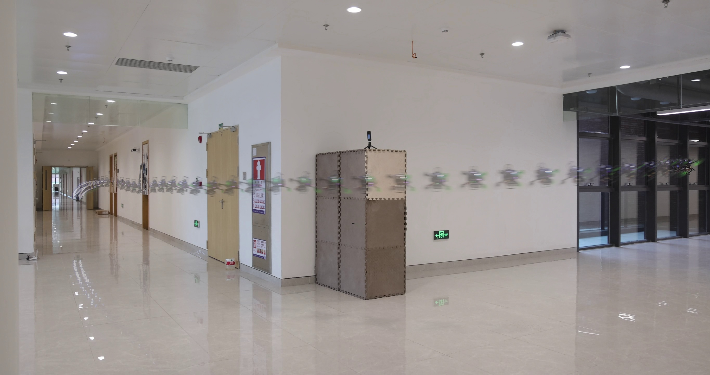
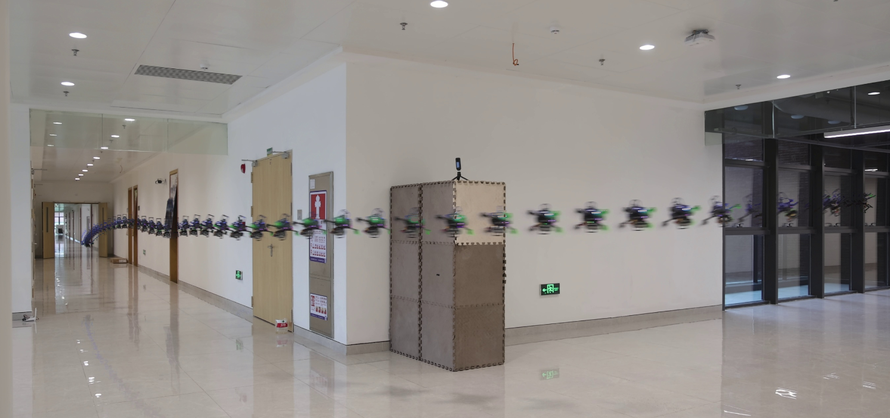
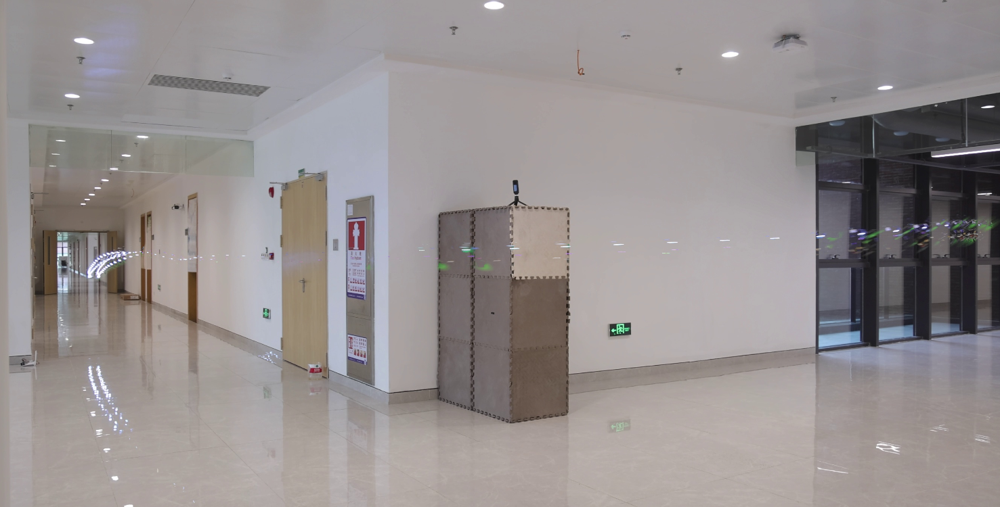

# Dynamo Figures

A Python package for creating composite images from videos. This tool extracts frames from a video and merges them using various composition modes to create stunning visual effects.

## Installation

### Install from Git
```bash
# Install directly from GitHub
pip install git+ssh://git@github.com/dynamicmobility/dynamo_figures.git
```

### Install from Local Directory
```bash
# From within the project directory
git clone git@github.com:dynamicmobility/dynamo_figures.git
cd dynamo_figures
pip install -e .
```

## Usage

### Command-Line Interface

After installation, you can use the `dynamo-composite-image` command:

#### 1. VAR Mode (Recommended)
Uses pixels that are furthest from the mean of the image, creating dynamic composite effects.

```bash
dynamo-composite-image --video_path ./example/video.mp4 --start_t 0.0 --end_t 99.0 --skip_frame 2 --mode VAR --alpha 0.4 --output ./example/composite.png
```


#### 2. MIN Mode
Keeps the darkest pixels from all frames.

```bash
dynamo-composite-image --video_path ./example/video.mp4 --start_t 0.0 --end_t 99.0 --skip_frame 2 --mode MIN --output ./example/composite.png
```


#### 3. MAX Mode
Keeps the lightest pixels from all frames.

```bash
dynamo-composite-image --video_path ./example/video.mp4 --start_t 0.0 --end_t 99.0 --skip_frame 2 --mode MAX --output ./example/composite.png
```


### Python API

You can also use the package programmatically in your Python scripts:

```python
from dynamo_figures import CompositeImage, CompositeMode
import cv2

# Create a composite image with VAR mode
merger = CompositeImage(
    mode=CompositeMode.MAX_VARIATION,
    video_path="./example/video.mp4",
    start_t=0.0,
    end_t=99.0,
    skip_frame=2,
    alpha=0.4,
    disable_pbar=False  # Set to True to disable the progress bar
)

# Generate the composite
result = merger.merge_images()

# Save the result
cv2.imwrite("output.jpg", result)
```

### Alternative Command-Line Methods

If you haven't installed the package, you can still run it:

```bash
# Run as a Python module
python -m dynamo_figures.composite_image --video_path ./example_video.mp4 --mode VAR

# Or run directly
python src/dynamo_figures/composite_image.py --video_path ./example_video.mp4 --mode VAR
```

## Parameters

* `--video_path` (required): Path to the input video file
* `--start_t`: Start time in seconds (default: 0)
* `--end_t`: End time in seconds (default: 999999)
* `--skip_frame`: Number of frames to skip when extracting frames. Use `1` to process every frame (default: 1)
* `--mode`: Composition mode, three options available:
  * `VAR` (Recommended): Uses pixels furthest from the mean, creating dynamic variation effects
  * `MAX`: Keeps the lightest pixels across all frames
  * `MIN`: Keeps the darkest pixels across all frames
* `--alpha`: Alpha blending factor for intermediate frames, range 0.0-1.0 (default: 0.5)
* `--disable_pbar`: Disable the progress bar when merging images (flag, no value needed)
* `--output`: Custom output file path (default: saves as `<video_name>.jpg` in the same directory as the input video)

## Dependencies

- Python >= 3.8
- opencv-python >= 4.0.0
- numpy >= 1.20.0
- tqdm >= 4.0.0

## License

All Rights Reserved 2023

## Credits

Original Author: renyunfan (renyf@connect.hku.hk)
