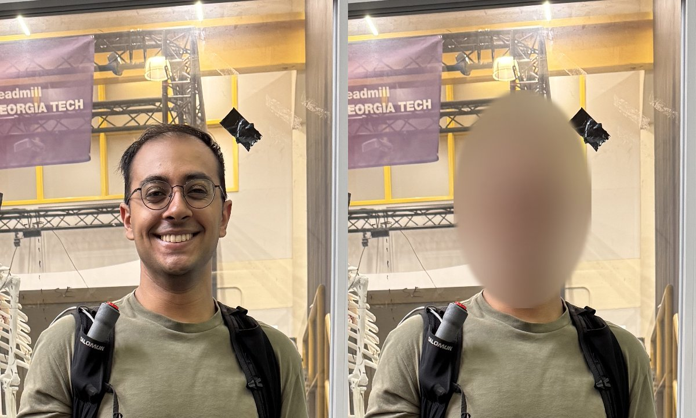

# Blur Faces
{: .fs-9 }

Anonymize faces in a photo or video by blurring, pixelating, or covering them.
{: .fs-6 .fw-300 }

---


*Before and after `blur-faces` with the default settings*
{: .text-center }

---

## Overview

The `blur-faces` tool finds every face in an image or video and obscures it.
Faces are detected with OpenCV's [YuNet](https://github.com/opencv/opencv_zoo/tree/main/models/face_detection_yunet)
model, which ships with this package, so **nothing is uploaded or downloaded**:
everything runs on your machine.

- **Photos**: faces are detected once and obscured. The output is written with
  OpenCV, which drops EXIF metadata (including GPS location).
- **Videos**: every frame is processed. Face boxes are tracked across frames:
  - Their position and size are smoothed (`--smoothing`) so the blur doesn't jitter.
  - When the detector briefly loses a face (motion blur, a turned head), its
    last box stays obscured for `--hold_frames` frames so the face doesn't flash
    through. If `ffmpeg` is installed, the output
  is H.264 and keeps the original audio. Without it, the output is a silent
  `mp4v` file.

## GPU Acceleration

By default the tool runs face detection on the CPU with OpenCV. Install the
optional `gpu` extra to run detection on the GPU through
[ONNX Runtime](https://onnxruntime.ai/) instead:

```bash
pip install -e ".[gpu]"
```

| Platform | Package installed | Backend |
|:---------|:------------------|:--------|
| macOS (Apple Silicon) | `onnxruntime` | CoreML (Apple GPU) |
| Linux / Windows with an NVIDIA GPU | `onnxruntime-gpu[cuda,cudnn]` | CUDA |

With `--device auto` (the default), the GPU is used whenever it is available.
The first lines of the video output show which backend was chosen, for example
`Detector: ONNX Runtime (CoreML)`. If the GPU backend fails to start (for
example, because the NVIDIA driver is too old), the tool prints a warning and
continues on the CPU.

{: .note }
> On Linux, the `[cuda,cudnn]` variant installs NVIDIA's CUDA 12 and cuDNN 9
> libraries through pip (a few GB), so no system CUDA toolkit is needed. You
> only need an NVIDIA driver that supports CUDA 12. Don't install `onnxruntime`
> and `onnxruntime-gpu` in the same environment.

Videos are processed as a pipeline: frames are decoded on a background thread,
detected in batches (`--batch_size`), and obscured in parallel on
`--workers` CPU threads. The finished frames are streamed straight into
ffmpeg, which encodes them as they arrive.

On an M1 Pro, a 10-second 1080×1920 video takes:

| Setup | Time |
|:------|-----:|
| `--device cpu` | ~12 s |
| `--device gpu` (CoreML) | ~5 s |

The output is identical either way.

Three styles are available:

- **`blur`** (default): a strong Gaussian blur with feathered edges
- **`pixelate`**: a mosaic of blocks
- **`fill`**: a solid color, the strongest anonymization

## Command-Line Usage

```bash
blur-faces --input <path> [options]
```

### Required Arguments

| Argument | Description |
|:---------|:------------|
| `--input` | Path to the input image or video |

### Optional Arguments

| Argument | Default | Description |
|:---------|:--------|:------------|
| `--output` | Auto | Output path (default: `<name>_blurred.<ext>`; videos default to `.mp4`) |
| `--style` | `blur` | `blur`, `pixelate`, or `fill` |
| `--shape` | `ellipse` | `ellipse` or `rect` |
| `--padding` | `0.25` | Fraction to enlarge each face box on every side |
| `--blur_strength` | `0.5` | *(blur)* Kernel size as a fraction of face size |
| `--pixel_blocks` | `10` | *(pixelate)* Number of blocks across each face |
| `--fill_color` | `black` | *(fill)* Color name or hex code, e.g. `'#eaaa00'` |
| `--score_threshold` | `0.6` | Minimum detection confidence (0–1). Lower it to catch more faces, at the cost of more false positives |
| `--nms_threshold` | `0.3` | Overlap threshold for merging duplicate detections |
| `--detect_max_dim` | `2048` | Longest side, in pixels, that frames are downscaled to before detection. Raise it for tiny faces in large photos, lower it for speed, or set `0` for full resolution |
| `--device` | `auto` | `auto`, `gpu`, or `cpu` (see [GPU Acceleration](#gpu-acceleration)) |
| `--batch_size` | `8` | *(video)* Frames detected per batch |
| `--workers` | # cores | *(video)* CPU threads for detection and blurring |
| `--smoothing` | `0.5` | *(video)* Box smoothing between frames, 0–1 (`0` = off). Higher values are steadier but lag behind fast motion |
| `--hold_frames` | `5` | *(video)* Frames to keep obscuring a face after it is lost |
| `--start_t` | Start | *(video)* Trim the output to start this many seconds into the input |
| `--end_t` | End | *(video)* Trim the output to end this many seconds into the input |
| `--no_audio` | `false` | *(video)* Drop the audio track |
| `--crf` | `18` | *(video)* H.264 quality; lower is better |
| `--draw_boxes` | `false` | Draw detection boxes and scores instead of obscuring |
| `--disable_pbar` | `false` | Disable the progress bar for videos |

{: .note }
> Smoothing never uncovers a face. If a face moves faster than the smoothed box
> can follow, the box is widened to also cover the face's current detection. On
> the example video, the default `0.5` cuts box jitter by about 60%.

{: .note }
> Face detection is never perfect. Always check the output before sharing it.
> If a face is missed, run with `--draw_boxes` and try a lower
> `--score_threshold` or a higher `--detect_max_dim`.

---

## Usage Examples

### Blur Faces in a Photo

```bash
blur-faces --input ./example/IMG_5579.jpg
```

### Pixelate Faces in a Video

```bash
blur-faces --input talk.mp4 --style pixelate --shape rect --output talk_anon.mp4
```

### Blur Only a Clip of a Video

```bash
blur-faces --input talk.mp4 --start_t 12.5 --end_t 30 --output clip_anon.mp4
```

Frames outside the range are never decoded, so trimming a short clip out of a
long video is proportionally faster. The audio is trimmed to match.

### Cover Faces with a Solid Color

```bash
blur-faces --input photo.jpg --style fill --fill_color '#eaaa00'
```

### Force the CPU

```bash
blur-faces --input talk.mp4 --device cpu
```

### Check What the Detector Finds

```bash
blur-faces --input crowd.jpg --draw_boxes --score_threshold 0.4 --detect_max_dim 4096
```

---

## Python API

```python
import cv2
from dynamo_figures import FaceBlur

blurrer = FaceBlur(style="pixelate", pixel_blocks=8, device="auto")
print(blurrer.device_name)  # e.g. "ONNX Runtime (CoreML)"

# Whole files
blurrer.process_image("photo.jpg", "photo_blurred.jpg")
blurrer.process_video("video.mp4", "video_blurred.mp4", keep_audio=True)
# Or just a slice of it, in seconds
blurrer.process_video("video.mp4", "clip.mp4", start_t=12.5, end_t=30)

# Or step by step on an array
image = cv2.imread("photo.jpg")
faces = blurrer.detect(image)          # [(x, y, w, h, score), ...]
# blurrer.detect_batch([img1, img2])   # same-sized images, one list per image
result = blurrer.apply(image, faces)
```

See the [API Reference](api-reference#class-faceblur) for all parameters.

## Code Layout

The tool lives in the `dynamo_figures.blur_faces` package:

| Module | Contents |
|:-------|:---------|
| `core.py` | `FaceBlur`, the high-level image/video API and video pipeline |
| `detectors.py` | YuNet detection on the CPU (OpenCV) or GPU (ONNX Runtime) |
| `tracking.py` | `FaceTracker`: frame-to-frame smoothing and hold |
| `obscure.py` | Blur, pixelate, and fill rendering |
| `video_io.py` | Threaded frame reading and ffmpeg encoding |
| `cli.py` | The `blur-faces` command (also `python -m dynamo_figures.blur_faces`) |
| `models/` | The bundled YuNet ONNX model |
