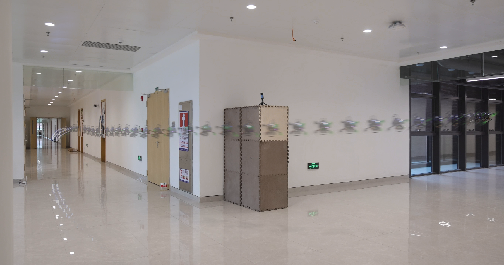

# Composite Image
{: .fs-9 }

Create stunning composite images by merging video frames using various composition modes.
{: .fs-6 .fw-300 }

---


*Example composite image created using VAR mode - showing motion trails from video frames*
{: .text-center }

---

## Overview

The `dynamo-composite-image` tool extracts frames from a video and merges them using different composition modes to create dynamic visual effects. This is useful for creating motion trails, long-exposure effects, and artistic visualizations.

## Command-Line Usage

```bash
dynamo-composite-image --video_path <path> [options]
```

### Required Arguments

| Argument | Description |
|:---------|:------------|
| `--video_path` | Path to the input video file |

### Optional Arguments

| Argument | Default | Description |
|:---------|:--------|:------------|
| `--mode` | `VAR` | Composition mode: `VAR`, `MAX`, or `MIN` |
| `--start_t` | `0` | Start time in seconds |
| `--end_t` | `999999` | End time in seconds |
| `--skip_frame` | `1` | Number of frames to skip (1 = process every frame) |
| `--alpha` | `0.5` | Alpha blending factor for intermediate frames (0.0-1.0) |
| `--output` | Auto | Output file path (default: `<video_name>.jpg`) |
| `--disable_pbar` | `false` | Disable progress bar |

---

## Composition Modes

### VAR Mode (Recommended)
{: .text-purple-300 }

Uses pixels that are furthest from the mean of all frames, creating dynamic composite effects with maximum variation.

```bash
dynamo-composite-image --video_path ./example/video.mp4 \
    --start_t 0.0 --end_t 99.0 \
    --skip_frame 2 --mode VAR \
    --alpha 0.4 --output ./composite.png
```

**Best for:** Motion trails, action sequences, dynamic scenes

---

### MIN Mode
{: .text-blue-300 }

Keeps the darkest pixels from all frames, creating a "minimum exposure" effect.

```bash
dynamo-composite-image --video_path ./example/video.mp4 \
    --start_t 0.0 --end_t 99.0 \
    --skip_frame 2 --mode MIN \
    --output ./composite.png
```

**Best for:** Dark backgrounds, silhouettes, removing bright objects

---

### MAX Mode
{: .text-yellow-300 }

Keeps the lightest pixels from all frames, creating a "maximum exposure" effect.

```bash
dynamo-composite-image --video_path ./example/video.mp4 \
    --start_t 0.0 --end_t 99.0 \
    --skip_frame 2 --mode MAX \
    --output ./composite.png
```

**Best for:** Light trails, bright objects on dark backgrounds, star trails

---

## Python API

You can also use the `CompositeImage` class programmatically:

```python
from dynamo_figures import CompositeImage, CompositeMode
import cv2

# Create a composite image with VAR mode
merger = CompositeImage(
    mode=CompositeMode.MAX_VARIATION,
    video_path="./example/video.mp4",
    start_t=0.0,
    end_t=99.0,
    skip_frame=2,
    alpha=0.4,
    disable_pbar=False
)

# Generate the composite
result = merger.merge_images()

# Save the result
cv2.imwrite("output.jpg", result)
```

### CompositeMode Enum

| Mode | Description |
|:-----|:------------|
| `CompositeMode.MAX_VARIATION` | Maximum variation from mean (VAR) |
| `CompositeMode.MIN_VALUE` | Minimum pixel values (MIN) |
| `CompositeMode.MAX_VALUE` | Maximum pixel values (MAX) |

### Constructor Parameters

```python
CompositeImage(
    mode,              # CompositeMode enum value
    video_path,        # Path to input video file
    start_t=0,         # Start time in seconds
    end_t=999,         # End time in seconds
    skip_frame=1,      # Frames to skip
    alpha=0.5,         # Alpha blending factor
    disable_pbar=False # Disable progress bar
)
```

### Methods

| Method | Returns | Description |
|:-------|:--------|:------------|
| `extract_frames()` | `list` | Extract frames from video as numpy arrays |
| `merge_images()` | `numpy.ndarray` | Create and return the composite image |

---

## Examples

### Process Only First 10 Seconds

```bash
dynamo-composite-image --video_path input.mp4 --end_t 10.0 --mode VAR
```

### Skip Every Other Frame for Faster Processing

```bash
dynamo-composite-image --video_path input.mp4 --skip_frame 2 --mode VAR
```

### Create High-Contrast Composite

```bash
dynamo-composite-image --video_path input.mp4 --alpha 1.0 --mode VAR
```

### Subtle Blending Effect

```bash
dynamo-composite-image --video_path input.mp4 --alpha 0.2 --mode VAR
```
