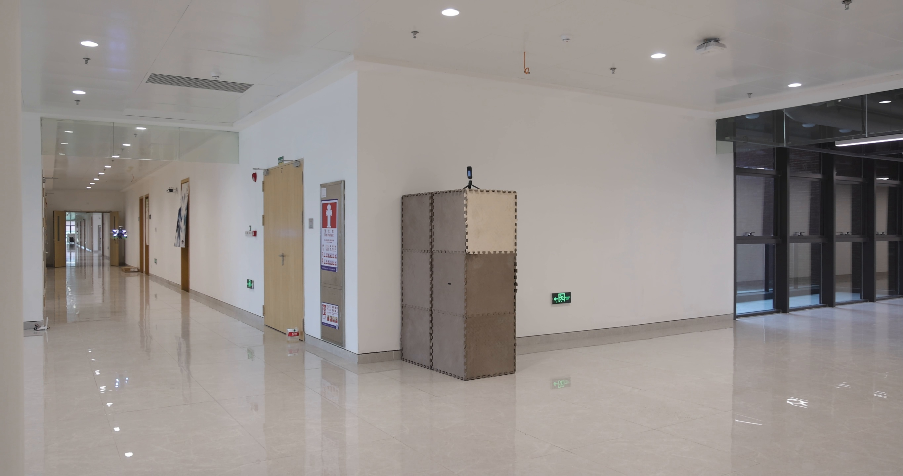

# Frame Extraction
{: .fs-9 }

Extract single frames from video files and save them as images.
{: .fs-6 .fw-300 }

---


*Example frame extracted from a video file using dynamo-pic-from-video*
{: .text-center }

---

## Overview

The `dynamo-pic-from-video` tool extracts a single frame from a video file and saves it as an image. You can specify the exact frame number, a time in seconds, or let it default to the middle frame.

## Command-Line Usage

```bash
dynamo-pic-from-video --video_path <path> [options]
```

### Required Arguments

| Argument | Description |
|:---------|:------------|
| `--video_path` | Path to the input video file |

### Optional Arguments

| Argument | Default | Description |
|:---------|:--------|:------------|
| `--output` | Auto | Output file path (default: `<video_name>_frame.jpg`) |
| `--frame` | None | Frame number to extract (0-indexed) |
| `--time` | None | Time in seconds to extract frame from |
| `--info_only` | `false` | Only display video information |

{: .warning }
> You cannot use both `--frame` and `--time` simultaneously. Choose one or the other.

---

## Usage Examples

### Extract Middle Frame (Default)

When no frame or time is specified, the middle frame is extracted:

```bash
dynamo-pic-from-video --video_path input.mp4 --output frame.jpg
```

### Extract Frame at Specific Time

Extract a frame at 5.5 seconds into the video:

```bash
dynamo-pic-from-video --video_path input.mp4 --time 5.5 --output frame.jpg
```

### Extract Specific Frame Number

Extract frame number 100 (frames are 0-indexed):

```bash
dynamo-pic-from-video --video_path input.mp4 --frame 100 --output frame.png
```

### Get Video Information Only

Display video properties without extracting a frame:

```bash
dynamo-pic-from-video --video_path input.mp4 --info_only
```

**Output:**
```
 -- Load Param: video path input.mp4
 -- Load Param: frame None
 -- Load Param: time None
 -- Video: input.mp4
 -- Dimensions: 1920x1080
 -- Frames: 3600
 -- FPS: 30.00
 -- Duration: 120.00 seconds
```

---

## Python API

You can also use the `FrameExtractor` class programmatically:

```python
from dynamo_figures.pic_from_video import FrameExtractor

# Create extractor for a specific time
extractor = FrameExtractor(
    video_path="./video.mp4",
    time_seconds=10.5
)

# Extract and save the frame
success = extractor.extract_frame("output.jpg")

if success:
    print("Frame extracted successfully!")
```

### Get Video Information

```python
from dynamo_figures.pic_from_video import FrameExtractor

extractor = FrameExtractor(video_path="./video.mp4")
info = extractor.get_video_info()

if info:
    print(f"Video: {info['path']}")
    print(f"Dimensions: {info['width']}x{info['height']}")
    print(f"Frames: {info['frame_count']}")
    print(f"FPS: {info['fps']:.2f}")
    print(f"Duration: {info['duration']:.2f} seconds")
```

### Constructor Parameters

```python
FrameExtractor(
    video_path,           # Path to input video file
    frame_number=None,    # Frame number to extract (0-indexed)
    time_seconds=None     # Time in seconds to extract frame from
)
```

### Methods

| Method | Returns | Description |
|:-------|:--------|:------------|
| `get_video_info()` | `dict` or `None` | Get video properties as a dictionary |
| `extract_frame(output_path)` | `bool` | Extract frame and save to specified path |

### Video Info Dictionary

The `get_video_info()` method returns a dictionary with the following keys:

| Key | Type | Description |
|:----|:-----|:------------|
| `path` | `str` | Path to the video file |
| `width` | `int` | Video width in pixels |
| `height` | `int` | Video height in pixels |
| `frame_count` | `int` | Total number of frames |
| `fps` | `float` | Frames per second |
| `duration` | `float` | Duration in seconds |

---

## Supported Formats

The tool supports any video format that OpenCV can read, including:

- MP4 (`.mp4`)
- AVI (`.avi`)
- MOV (`.mov`)
- MKV (`.mkv`)
- WebM (`.webm`)
- And many more...

Output images can be saved in any format supported by OpenCV:

- JPEG (`.jpg`, `.jpeg`)
- PNG (`.png`)
- BMP (`.bmp`)
- TIFF (`.tiff`)
- WebP (`.webp`)
