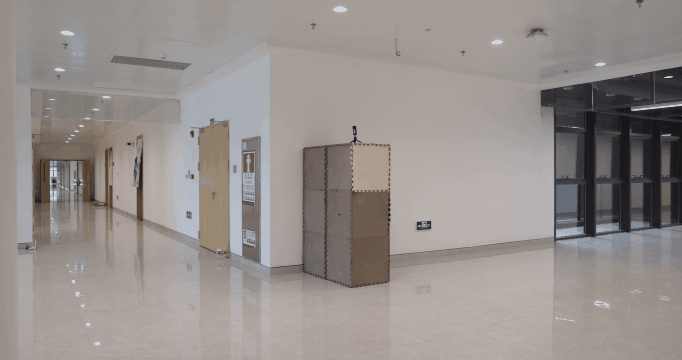

# Video to GIF
{: .fs-9 }

Convert video files to animated GIFs with full control over timing, frame rate, and size.
{: .fs-6 .fw-300 }

---


*Example GIF created from a video file using video-to-gif*
{: .text-center }

---

## Overview

The `video-to-gif` tool converts video files to animated GIFs. It supports time range selection, frame rate control, resizing, and optional effects like boomerang (reverse) looping.

[Command-Line Usage](#command-line-usage){: .btn .btn-primary .fs-5 .mb-4 .mb-md-0 .mr-2 }
[Python API](#python-api){: .btn .fs-5 .mb-4 .mb-md-0 }

## Command-Line Usage

```bash
video-to-gif --video_path <path> [options]
```

### Required Arguments

| Argument | Description |
|:---------|:------------|
| `--video_path` | Path to the input video file |

### Optional Arguments

| Argument | Default | Description |
|:---------|:--------|:------------|
| `--output` | Auto | Output file path (default: `<video_name>.gif`) |
| `--fps` | `10` | Output GIF frame rate |
| `--start_t` | `0` | Start time in seconds |
| `--end_t` | End of video | End time in seconds |
| `--scale` | `1.0` | Scale factor for output size (0.01-2.0) |
| `--width` | None | Target width in pixels (maintains aspect ratio, overrides `--scale`) |
| `--crop_width` | None | Crop output to this width in pixels (center crop) |
| `--crop_height` | None | Crop output to this height in pixels (center crop) |
| `--speed` | `1.0` | Playback speed multiplier (e.g. `2.0` = 2x faster, `0.5` = half speed) |
| `--loop` | `0` | Number of loops (0 = infinite) |
| `--no_optimize` | `false` | Disable GIF optimization |
| `--reverse` | `false` | Add reverse frames for boomerang effect |
| `--disable_pbar` | `false` | Disable progress bar |
| `--info_only` | `false` | Only display video information |

---

## Usage Examples

### Full Example

Create a high-quality, cropped, sped-up GIF from a specific time range:

```bash
video-to-gif --video_path ./example/video.mp4 \
    --start_t 1.5 --end_t 4.0 \
    --fps 15 --width 480 \
    --crop_height 300 --speed 1.5 \
    --reverse --output ./example.gif
```

### Basic Conversion

Convert an entire video to GIF with default settings:

```bash
video-to-gif --video_path input.mp4
```

### Extract a Time Range

Create a GIF from seconds 2 to 5 of the video:

```bash
video-to-gif --video_path input.mp4 --start_t 2.0 --end_t 5.0
```

### Control Frame Rate

Create a smoother GIF with higher frame rate:

```bash
video-to-gif --video_path input.mp4 --fps 15
```

Create a smaller file with lower frame rate:

```bash
video-to-gif --video_path input.mp4 --fps 5
```

### Resize Output

Scale down to 50% of original size:

```bash
video-to-gif --video_path input.mp4 --scale 0.5
```

Set a specific width (height auto-calculated):

```bash
video-to-gif --video_path input.mp4 --width 320
```

### Crop Output

Crop the output to specific dimensions via center crop:

```bash
video-to-gif --video_path input.mp4 --crop_width 640 --crop_height 360
```

Crop only one dimension (e.g. trim height while keeping full width):

```bash
video-to-gif --video_path input.mp4 --width 800 --crop_height 400
```

### Change Playback Speed

Speed up the GIF to 2x:

```bash
video-to-gif --video_path input.mp4 --speed 2.0
```

Slow down to half speed:

```bash
video-to-gif --video_path input.mp4 --speed 0.5
```

### Boomerang Effect

Create a GIF that plays forward then backward:

```bash
video-to-gif --video_path input.mp4 --reverse
```

### Get Video Information Only

Display video properties without converting:

```bash
video-to-gif --video_path input.mp4 --info_only
```

**Output:**
```
 -- Load Param: video path input.mp4
 -- Load Param: fps 10
 -- Load Param: start_t 0
 -- Load Param: end_t None
 -- Load Param: scale 1.0
 -- Load Param: width None
 -- Load Param: crop_width None
 -- Load Param: crop_height None
 -- Load Param: speed 1.0
 -- Load Param: loop 0
 -- Load Param: optimize True
 -- Load Param: reverse False
 -- Video: input.mp4
 -- Dimensions: 1920x1080
 -- Frames: 3600
 -- FPS: 30.00
 -- Duration: 120.00 seconds
```

---

## Python API

You can also use the `VideoToGif` class programmatically:

```python
from dynamo_figures.video_to_gif import VideoToGif

# Create a GIF from a video
converter = VideoToGif(
    video_path="./video.mp4",
    fps=15,
    start_t=2.0,
    end_t=5.0,
    scale=0.5,
    reverse=True
)

# Convert and save
success = converter.convert("output.gif")

if success:
    print("GIF created successfully!")
```

### Constructor Parameters

```python
VideoToGif(
    video_path,           # Path to input video file
    fps=10,               # Output GIF frame rate
    start_t=0,            # Start time in seconds
    end_t=None,           # End time in seconds (None = end of video)
    scale=1.0,            # Scale factor for output size
    width=None,           # Target width (overrides scale)
    crop_width=None,      # Crop to this width (center crop)
    crop_height=None,     # Crop to this height (center crop)
    speed=1.0,            # Playback speed multiplier
    loop=0,               # Number of loops (0 = infinite)
    optimize=True,        # Optimize GIF for smaller size
    reverse=False,        # Add reverse frames (boomerang)
    disable_pbar=False    # Disable progress bar
)
```

### Methods

| Method | Returns | Description |
|:-------|:--------|:------------|
| `get_video_info()` | `dict` or `None` | Get video properties as a dictionary |
| `extract_frames()` | `list` or `None` | Extract frames as numpy arrays (RGB) |
| `convert(output_path)` | `bool` | Convert video to GIF and save to path |

### Video Info Dictionary

The `get_video_info()` method returns a dictionary with the following keys:

| Key | Type | Description |
|:----|:-----|:------------|
| `path` | `str` | Path to the video file |
| `width` | `int` | Video width in pixels |
| `height` | `int` | Video height in pixels |
| `frame_count` | `int` | Total number of frames |
| `fps` | `float` | Frames per second |
| `duration` | `float` | Duration in seconds |

---

## Tips for Smaller GIF Files

GIF files can get large quickly. Here are some tips to reduce file size:

### 1. Lower Frame Rate

Reduce FPS to the minimum acceptable level:

```bash
video-to-gif --video_path input.mp4 --fps 8
```

### 2. Resize the Output

Scale down the resolution:

```bash
video-to-gif --video_path input.mp4 --scale 0.5
# or
video-to-gif --video_path input.mp4 --width 320
```

### 3. Shorter Duration

Extract only the most important part:

```bash
video-to-gif --video_path input.mp4 --start_t 1.0 --end_t 3.0
```

### 4. Keep Optimization Enabled

Don't use `--no_optimize` unless necessary.

---

## Dependencies

The `video-to-gif` tool requires Pillow for GIF creation:

```bash
pip install Pillow
```

{: .note }
> Pillow is automatically installed when you install the `dynamo-figures` package.

---

## Supported Formats

### Input Video Formats

Any video format supported by OpenCV:
- MP4 (`.mp4`)
- AVI (`.avi`)
- MOV (`.mov`)
- MKV (`.mkv`)
- WebM (`.webm`)
- And many more...

### Output Format

- GIF (`.gif`)
